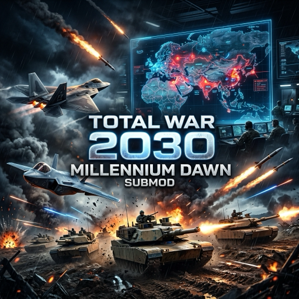

# Total War 2030 — Millennium Dawn Submod



[](https://store.steampowered.com/app/394360/Hearts_of_Iron_IV/)
[](https://steamcommunity.com/sharedfiles/filedetails/?id=2777392649)
[]()
[]()

> **Transform Millennium Dawn from a peacetime economic simulator into an intense, escalating global arms race culminating in Total War around the year 2030.**

---

## 📌 Overview

**Total War 2030** is an AI overhaul and dynamic escalation submod for **Millennium Dawn: Modern Day Mod** (Hearts of Iron IV).

In standard Millennium Dawn, major powers frequently remain passive—stockpiling minimal military equipment, investing heavily in civilian offices, and rarely engaging in peer-to-peer conventional warfare.

**Total War 2030** solves this passivity without railroaded scripts or artificial free unit spawns. Through systemic AI strategic profiles, dynamic threat mechanics, evolving military readiness, and industrial re-tooling, global powers react organically to rising tension, sparking a realistic strategic arms race that sets the stage for high-intensity conventional conflict by 2030.

---

## ⚡ Key Features

* 📈 **Dynamic 4-Phase Escalation System**: Organic geopolitical transition from peacetime stability (2000–2014) to regional friction (2015–2024), pre-war strategic mobilization (2025–2029), and full Total War posture (2030+).
* 🧠 **Smart & Fair AI Rearmament**: Major AI nations dynamically shift industrial construction toward Military Factories (MIC) and Naval Dockyards (NIC) as global threat escalates.
* 📦 **Stockpile & Weapon Dump Protection**: Prevents AI nations from liquidating massive reserves of MBTs, IFVs, SAMs, and small arms for quick cash during crisis eras.
* 🛡️ **Financial Insolvency Guarding**: Integrates with Millennium Dawn's economic systems to ensure rearming AI powers maintain fiscal stability without triggering premature economic collapse.
* 🎖️ **Strategic Force Scaling**: Multiplies division, naval, and air force limiters progressively, pushing Great Powers (USA, China, Russia, NATO, India) into realistic force building.

---

## ⏳ Geopolitical Timeline

```text
+-----------------------------------------------------------------------------------+
| ERA 1: Stability & Modernization (2000 - 2014)                                    |
| • Economic growth, counter-terrorism, peacetime budget limits                     |
+-----------------------------------------------------------------------------------+
                                         │
                                         ▼
+-----------------------------------------------------------------------------------+
| ERA 2: Geopolitical Friction (2015 - 2024)                                        |
| • Regional proxy wars, threat growth, initial military industrial re-tooling      |
+-----------------------------------------------------------------------------------+
                                         │
                                         ▼
+-----------------------------------------------------------------------------------+
| ERA 3: Strategic Arms Race & Mobilization (2025 - 2029)                            |
| • Great power polarization, defense budget spikes, 5th-gen & SAM prioritization   |
+-----------------------------------------------------------------------------------+
                                         │
                                         ▼
+-----------------------------------------------------------------------------------+
| ERA 4: Total War Era (2030+)                                                      |
| • Peak global threat, full military readiness, unconstrained strategic warfare     |
+-----------------------------------------------------------------------------------+
```

---

## 🛠️ Installation & Setup

### Prerequisites
1. **Hearts of Iron IV** (version `1.19.*`)
2. **Millennium Dawn: Modern Day Mod** (or Developer Version)

### Manual Installation (Development / Local Mod)
1. Clone this repository into your local workspace:
   ```bash
   git clone https://github.com/ca-santos/millennium-dawn-total-war-2030.git
   ```
2. Copy or symlink `descriptor.mod` to your Paradox HOI4 mod directory:
   - **macOS**: `~/Documents/Paradox Interactive/Hearts of Iron IV/mod/total_war_2030.mod`
   - **Windows**: `C:\Users\<User>\Documents\Paradox Interactive/Hearts of Iron IV/mod/total_war_2030.mod`
3. Ensure the `path` attribute in `total_war_2030.mod` points to your cloned directory:
   ```mod
   path="/Users/yourname/Workspace/total-war-2030-submod"
   ```
4. Launch the **Paradox Launcher**, enable **Total War 2030** in your playset along with **Millennium Dawn**, and start the game!

---

## 👥 Credits & Compatibility

- Developed for **Millennium Dawn: Modern Day Mod**.
- Fully compatible with Millennium Dawn's economy, focus trees, tech trees, and unit templates.
